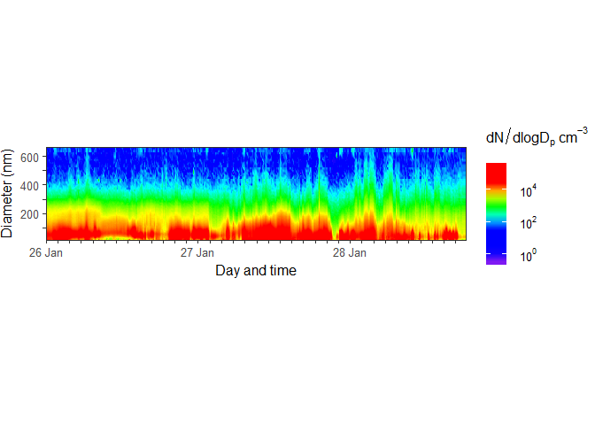
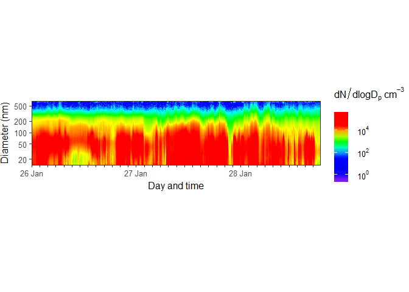
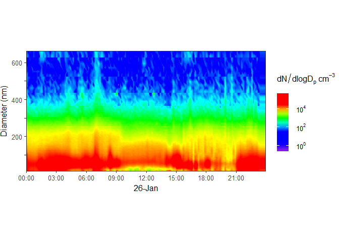
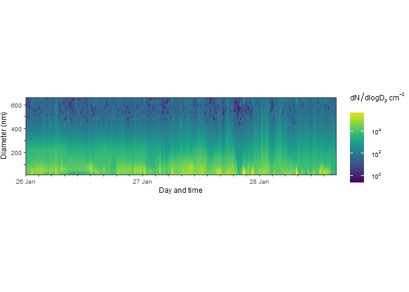
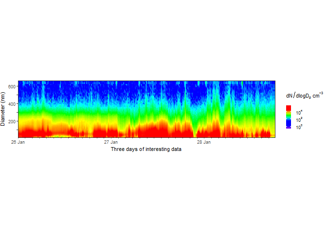
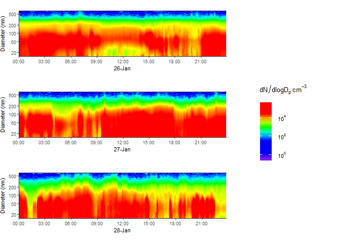

<!-- README.md is generated from README.Rmd. Please edit that file -->
[](https://travis-ci.org/benmarwick/smps)

SMPS
====

Introduction
------------

This package produces time series colour contour plots of data from [Scanning Mobility Particle Sizer (SMPS)](https://en.wikipedia.org/wiki/Scanning_mobility_particle_sizer) data. The SMPS is the standard method to measure airborne particle size distributions. The kind of plots that this package produces are widely used for visualising SMPS data in atmospheric science.

How to install the package
--------------------------

You will need the `devtools` package from CRAN so you can install this package from github with the following line of code:

``` r
# install.packages("devtools")
devtools::install_github("benmarwick/smps")
library(smps)
```

How to use the package
----------------------

First, read your data into R using `read.csv` or similar, and check that it is in a format that works with this package.

You can inspect the example dataset that comes with the package like this:

``` r
data("my_data")
str(my_data)
head(my_data)
View(my_data)
```

Second, prepare your data for plotting using the `prepare_data` function. This converts the variable types and data format into forms suitable for plotting. It also does interpolation of the measured values to give a smooth contour plot. The interpolation can take a minute or two. You can experiment with the interpolation parameters to speed up the operation.

``` r
# prepare the data
prepared_data <- prepare_data(my_data)
```

Third, plot the data, like so:

``` r
smps_plot(prepared_data)
```

<!-- -->

We can also have a log scale on the y-axis:

``` r
smps_plot(prepared_data, y_axis = "log")
```

<!-- -->

We can plot a data from a single day:

``` r
smps_plot(prepared_data, 
          day = "2013-01-26", 
          aspect_ratio = 1/2, 
          h = '3 hours')
```

<!-- -->

We can customise a variety of options, including the colour ramp:

``` r
require(viridis)
smps_plot(prepared_data, 
          font_size = 9, 
          h = '3 hours',
          y_breaks = 100,
          aspect_ratio = 1/4,
          colour_ramp = viridis) 
```

<!-- -->

Because the output is a ggplot object, we can add typical ggplot elements to it like a regular `ggplot()` call:

``` r
require(ggplot2)
smps_plot(prepared_data, font_size = 8) + 
  theme(legend.key.size = unit(0.1, "in") )
```

<!-- -->

With `gridExtra` we can stack a few plots together, and arrange a common legend to the side:

``` r
library(gridExtra)
# select the days to plot
the_days <- c("2013-01-26", "2013-01-27", "2013-01-28")
# draw three plots, one day each, collect them in a list
the_plots <- lapply(the_days, function(i) smps_plot(prepared_data, 
                                                    day = i, 
                                                    y_axis = "log",  
                                                    h = '3 hours', 
                                                    font_size = 8) +   
                                                    guides(fill = FALSE))
  
# we extract the legend of the a plot to use separately
the_legend <- get_legend(smps_plot(prepared_data, 
                                   day = "2013-01-26", 
                                   font_size = 10))

# arrange the plots and scale
grid.arrange(the_plots[[1]], 
             the_plots[[2]], 
             the_plots[[3]], 
             the_legend, 
             layout_matrix = rbind(c(1,1,4),c(2,2,4),c(3,3,4)))
```

<!-- -->

Please note that this project is released with a [Guide to Contributing](CONTRIBUTING.md) and a [Contributor Code of Conduct](CONDUCT.md). By participating in this project you agree to abide by its terms.
